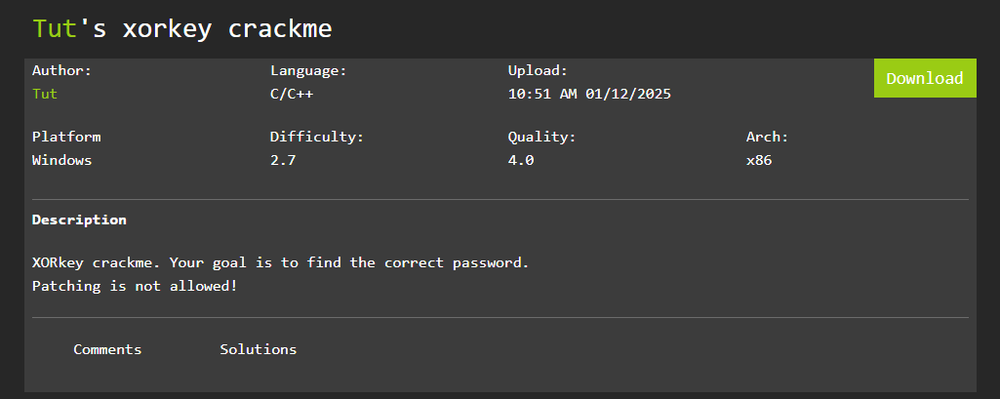
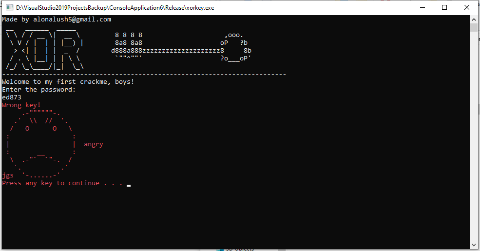
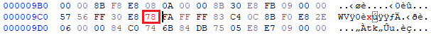
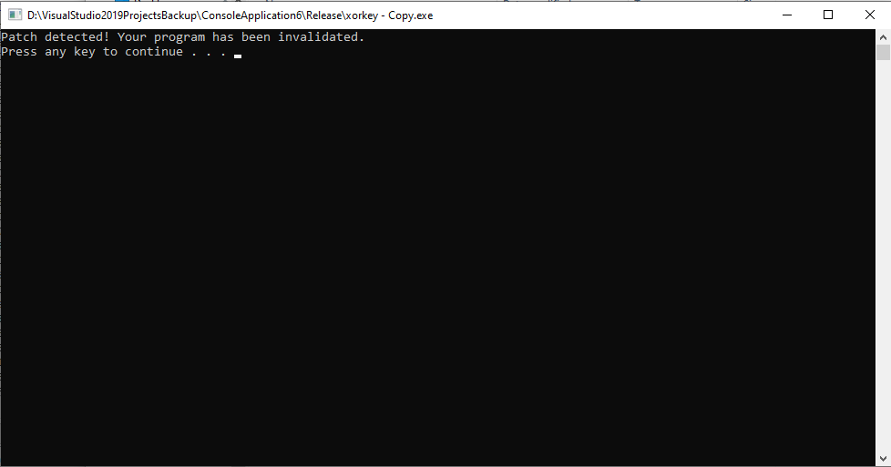

# xorkey-crackme

[](https://choosealicense.com/licenses/mit/)

Simple crackme challenge I made in C, sprinkled with nice ASCII art. Made with Visual Studio 2019, uploaded on [crackmes.one](https://crackmes.one/crackme/67839eb34d850ac5f7dc50bd).



# How it works

Upon entering a bad password, the program will print an angry smily face emoji in red:



Your goal is to find the correct password so that it prints the success message. The validation process is a simple XOR routine.

# Anti patch

One cool feature I implemented in this crackme is anti-patching with a CRC-32 algorithm.

If you patch the `.exe` file with let's say, HxD:



And run the patched file:



You'll be met with the message: 

```
Patch detected! Your program has been invalidated.
Press any key to continue . . .
```

Very simple, of course, but good challenge for beginner reverse engineers.


